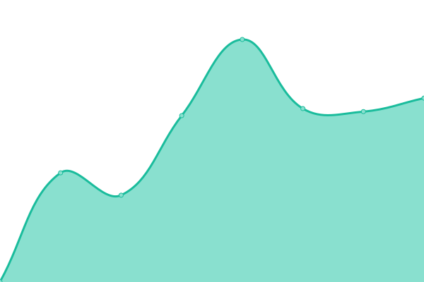

# [📈 Live Status](https://upptime.dhedegaard.dk): <!--live status--> **🟩 All systems operational**

This repository contains the open-source uptime monitor and status page for [Dennis Hedegaard](https://dhedegaard.dk/), powered by [Upptime](https://github.com/upptime/upptime).

With [Upptime](https://upptime.js.org), you can get your own unlimited and free uptime monitor and status page, powered entirely by a GitHub repository. We use [Issues](https://github.com/dhedegaard/upptime/issues) as incident reports, [Actions](https://github.com/dhedegaard/upptime/actions) as uptime monitors, and [Pages](https://upptime.dhedegaard.dk) for the status page.

<!--start: status pages-->
<!-- This summary is generated by Upptime (https://github.com/upptime/upptime) -->
<!-- Do not edit this manually, your changes will be overwritten -->
<!-- prettier-ignore -->
| URL | Status | History | Response Time | Uptime |
| --- | ------ | ------- | ------------- | ------ |
|  [dhedegaard.dk](https://www.dhedegaard.dk) | 🟩 Up | [dhedegaard-dk.yml](https://github.com/dhedegaard/upptime/commits/HEAD/history/dhedegaard-dk.yml) | 

 391ms
     
 | 

<a href="https://status.dhedegaard.dk/history/dhedegaard-dk">100.00%</a>
    

|  [culan.dk](https://www.culan.dk) | 🟩 Up | [culan-dk.yml](https://github.com/dhedegaard/upptime/commits/HEAD/history/culan-dk.yml) | 

 245ms
     
 | 

<a href="https://status.dhedegaard.dk/history/culan-dk">100.00%</a>
    

|  [api.culan.dk](https://api.culan.dk/graphql) | 🟩 Up | [api-culan-dk.yml](https://github.com/dhedegaard/upptime/commits/HEAD/history/api-culan-dk.yml) | 

 1541ms
     
 | 

<a href="https://status.dhedegaard.dk/history/api-culan-dk">100.00%</a>
    

|  [Pollen](https://pollen.dhedegaard.dk) | 🟩 Up | [pollen.yml](https://github.com/dhedegaard/upptime/commits/HEAD/history/pollen.yml) | 

 3730ms
     
 | 

<a href="https://status.dhedegaard.dk/history/pollen">100.00%</a>
    

|  [Youtube aggregator](https://ut.dhedegaard.dk) | 🟩 Up | [youtube-aggregator.yml](https://github.com/dhedegaard/upptime/commits/HEAD/history/youtube-aggregator.yml) | 

 268ms
     
 | 

<a href="https://status.dhedegaard.dk/history/youtube-aggregator">100.00%</a>
    

|  [Advent of Code 2020](https://aoc2020.dhedegaard.dk) | 🟩 Up | [advent-of-code-2020.yml](https://github.com/dhedegaard/upptime/commits/HEAD/history/advent-of-code-2020.yml) | 

 1302ms
     
 | 

<a href="https://status.dhedegaard.dk/history/advent-of-code-2020">96.61%</a>
    

|  [Advent of Code 2019](https://aoc2019.dhedegaard.dk) | 🟩 Up | [advent-of-code-2019.yml](https://github.com/dhedegaard/upptime/commits/HEAD/history/advent-of-code-2019.yml) | 

 980ms
     
 | 

<a href="https://status.dhedegaard.dk/history/advent-of-code-2019">96.61%</a>
    

|  [Neversink downloader](https://neversink.culan.dk) | 🟩 Up | [neversink-downloader.yml](https://github.com/dhedegaard/upptime/commits/HEAD/history/neversink-downloader.yml) | 

 239ms
     
 | 

<a href="https://status.dhedegaard.dk/history/neversink-downloader">100.00%</a>
    

|  [u.dhedegaard.dk](https://u.dhedegaard.dk) | 🟩 Up | [u-dhedegaard-dk.yml](https://github.com/dhedegaard/upptime/commits/HEAD/history/u-dhedegaard-dk.yml) | 

 5635ms
     
 | 

<a href="https://status.dhedegaard.dk/history/u-dhedegaard-dk">100.00%</a>
    

<!--end: status pages-->

[**Visit our status website →**](https://upptime.dhedegaard.dk)

## 📄 License

- Powered by: [Upptime](https://github.com/upptime/upptime)
- Code: [MIT](./LICENSE) © [Dennis Hedegaard](https://dhedegaard.dk/)
- Data in the `./history` directory: [Open Database License](https://opendatacommons.org/licenses/odbl/1-0/)
