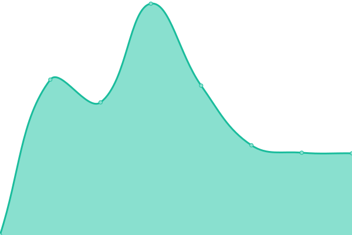
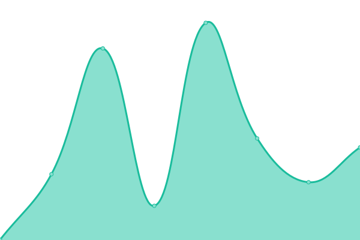

# [📈 Live Status](https://upptime.dhedegaard.dk): <!--live status--> **🟩 All systems operational**

This repository contains the open-source uptime monitor and status page for [Dennis Hedegaard](https://dhedegaard.dk/), powered by [Upptime](https://github.com/upptime/upptime).

With [Upptime](https://upptime.js.org), you can get your own unlimited and free uptime monitor and status page, powered entirely by a GitHub repository. We use [Issues](https://github.com/dhedegaard/upptime/issues) as incident reports, [Actions](https://github.com/dhedegaard/upptime/actions) as uptime monitors, and [Pages](https://upptime.dhedegaard.dk) for the status page.

<!--start: status pages-->
<!-- This summary is generated by Upptime (https://github.com/upptime/upptime) -->
<!-- Do not edit this manually, your changes will be overwritten -->
<!-- prettier-ignore -->
| URL | Status | History | Response Time | Uptime |
| --- | ------ | ------- | ------------- | ------ |
|  [dhedegaard.dk](https://www.dhedegaard.dk) | 🟩 Up | [dhedegaard-dk.yml](https://github.com/dhedegaard/upptime/commits/master/history/dhedegaard-dk.yml) | 

 789ms
     
 | 

<a href="https://status.dhedegaard.dk/history/dhedegaard-dk">100.00%</a>
    

|  [culan.dk](https://www.culan.dk) | 🟩 Up | [culan-dk.yml](https://github.com/dhedegaard/upptime/commits/master/history/culan-dk.yml) | 

 266ms
     
 | 

<a href="https://status.dhedegaard.dk/history/culan-dk">100.00%</a>
    

|  [Poetracker](https://poe.culan.dk) | 🟩 Up | [poetracker.yml](https://github.com/dhedegaard/upptime/commits/master/history/poetracker.yml) | 

 773ms
     
 | 

<a href="https://status.dhedegaard.dk/history/poetracker">100.00%</a>
    

|  [Pollen](https://pollen.dhedegaard.dk) | 🟩 Up | [pollen.yml](https://github.com/dhedegaard/upptime/commits/master/history/pollen.yml) | 

 605ms
     
 | 

<a href="https://status.dhedegaard.dk/history/pollen">100.00%</a>
    

|  [Youtube aggregator](https://ut.dhedegaard.dk) | 🟩 Up | [youtube-aggregator.yml](https://github.com/dhedegaard/upptime/commits/master/history/youtube-aggregator.yml) | 

 1593ms
     
 | 

<a href="https://status.dhedegaard.dk/history/youtube-aggregator">100.00%</a>
    

<!--end: status pages-->

[**Visit our status website →**](https://upptime.dhedegaard.dk)

## 📄 License

- Powered by: [Upptime](https://github.com/upptime/upptime)
- Code: [MIT](./LICENSE) © [Dennis Hedegaard](https://dhedegaard.dk/)
- Data in the `./history` directory: [Open Database License](https://opendatacommons.org/licenses/odbl/1-0/)
